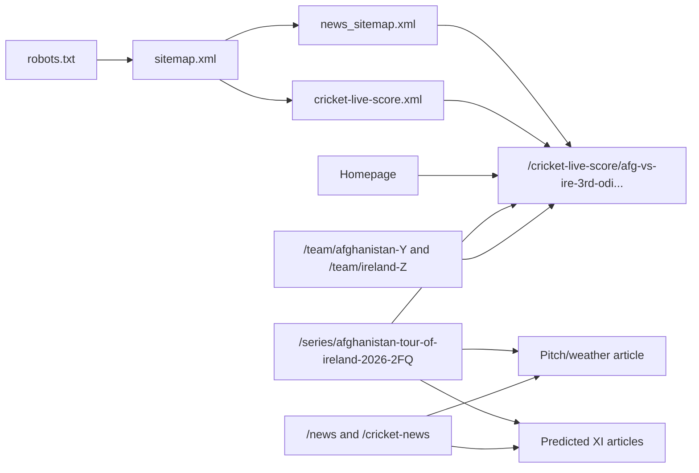

# CREX Live Cricket SEO Discovery Architecture Investigation

Checked: 2026-08-10 13:00-13:25 UTC / 18:30-18:55 IST

Evidence artifacts:

- `artifacts/seo-crex-investigation/crex-discovery-evidence.json`
- `artifacts/seo-crex-investigation/targeted-page-evidence.json`
- `artifacts/seo-crex-investigation/crickzen-targeted-page-evidence.json`
- raw XML/HTML-derived captures under `artifacts/seo-crex-investigation/raw/`
- reusable script: `scripts/seo/crex_discovery_investigation.py`

## 1. Executive conclusion

CREX is not merely publishing ordinary match pages and hoping Google finds them. Its production architecture combines a large canonical match URL corpus, a high-frequency Google News sitemap, a substantial editorial article system, and crawlable entity hubs. The strongest verified finding is that `https://crex.com/crex_sitemap/news_sitemap.xml` is a real Google News sitemap using `<news:news>`, `<news:publication>`, `<news:publication_date>`, and `<news:title>`. On 2026-08-10 it contained fresh live-score match URLs such as `https://crex.com/cricket-live-score/afg-vs-ire-3rd-odi-afghanistan-tour-of-ireland-2026-match-updates-114O`, not just editorial articles.

CREX match pages use stable `/cricket-live-score/{slug}` URLs. Representative live and completed match pages were self-canonical, indexable, and server-rendered. The live AFG vs IRE page had `SportsEvent`, `LiveBlogPosting`, and `NewsArticle` JSON-LD in raw HTML. A pre-match/later TNPL page had `SportsEvent` but not `NewsArticle`, which suggests CREX schema is lifecycle-sensitive rather than a blanket markup rule.

The editorial system is real: recent CREX articles around IRE vs AFG included pitch/weather, predicted XI, and head-to-head content, all with `NewsArticle` schema and self-canonicals. However, sampled article HTML did not expose direct article-to-match anchors. The stronger match-discovery mechanism appears to be match inclusion in fresh News sitemap plus series/team/homepage crawl paths, with editorial building topical authority and query coverage around the same entity.

Crickzen should not copy CREX blindly, especially not by marking every `SportsEvent` as fake news or using Google Indexing API. Crickzen should preserve `/cric-live/{slug}` as the canonical match entity, strengthen early crawl paths and real team-name anchor text, then test a restrained editorial cluster only for selected Tier A/B matches where proprietary prediction/live-intelligence data can create genuinely differentiated content.

## 2. Verified CREX architecture

Facts only:

- `https://crex.com/robots.txt` allows the site broadly and declares three sitemap entry points:
  - `https://crex.com/sitemap.xml`
  - `https://crex.com/crex_sitemap/news_sitemap.xml`
  - `https://a286825.sitemaphosting6.com/4510197/sitemap_4510197.xml`
- `https://crex.com/sitemap.xml` is a sitemap index with 15 child sitemap entries.
- CREX has a dedicated match sitemap: `https://crex.com/crex_sitemap/cricket-live-score.xml`.
- CREX has monthly news archive sitemaps for 2026 and a current Google News sitemap.
- CREX has entity sitemaps for player, team, series, rankings, and stats.
- CREX uses `/cricket-live-score/{slug}` as the match URL family.
- CREX uses `/cricket-news/{slug}`, `/cricket-analysis/{slug}`, `/cricket-prediction/{slug}`, and `/cricket-records/{slug}` as editorial URL families.

## 3. CREX sitemap architecture

| Sitemap | Purpose | URL Count | URL Types | lastmod Behaviour | Interesting |
| --- | --- | ---: | --- | --- | --- |
| `https://crex.com/sitemap.xml` | Sitemap index | 15 child sitemaps | news archive, players, teams, live-score, series, stats | child-level lastmod | Central discovery map |
| `https://crex.com/crex_sitemap/news_sitemap.xml` | Current Google News sitemap | 57-59 during checks | live match pages and recent editorial URLs | changed during the run; examples at `2026-08-10T18:11:00+05:30` | Uses Google News namespace |
| `https://crex.com/crex_sitemap/cricket-live-score.xml` | Match URL sitemap | 22,877 | `/cricket-live-score` match URLs | live/completed/upcoming match lastmods | Canonical match corpus |
| `https://crex.com/crex_sitemap/news_archive_2026_08.xml` | August 2026 editorial archive | 301 | news, prediction, pitch, streaming, analysis, records | publication-like timestamps | Current month article corpus |
| `https://crex.com/crex_sitemap/news_archive_2026_07.xml` | July 2026 editorial archive | 1,093 | news, prediction, pitch, playing XI, reports | historical timestamps | Large retained editorial archive |
| `https://crex.com/crex_sitemap/player.xml` | Player entities | 15,955 | player/profile URLs | entity freshness | Entity graph scale |
| `https://crex.com/crex_sitemap/team.xml` | Team entities | 1,444 | team URLs | entity freshness | Team discovery |
| `https://crex.com/crex_sitemap/series.xml` | Series entities | 2,120 | series URLs | entity freshness | Series discovery |
| `https://crex.com/crex_sitemap/stats.xml` | Stats pages | 1,625 | stats URLs | entity freshness | Evergreen/stat intent |
| `https://a286825.sitemaphosting6.com/4510197/sitemap_4510197.xml` | External sitemap index | 2 child sitemaps | broad URL inventory | hosted externally | 50k URLs across child files |

`news_sitemap.xml` is a real Google News sitemap, not merely a normal sitemap with a news filename. It contains `<news:news>`, `<news:publication>`, `<news:publication_date>`, and `<news:title>`. Google’s current News sitemap guidance says only recent URLs for articles created in the last two days should be included, and older URLs should be removed or have News metadata removed. Source: Google Search Central, "Create a News Sitemap" (`https://developers.google.com/search/docs/crawling-indexing/sitemaps/news-sitemap`).

Important nuance: CREX includes live-score match URLs in that News sitemap. Example entry:

`https://crex.com/cricket-live-score/afg-vs-ire-3rd-odi-afghanistan-tour-of-ireland-2026-match-updates-114O`

with:

- `lastmod`: `2026-08-10T18:11:00+05:30`
- `news:publication_date`: `2026-08-10T11:15:00+05:30`
- `news:title`: live score headline including score state

## 4. CREX match lifecycle architecture

| Match | Lifecycle | URL | Status | Canonical | Robots | H1 |
| --- | --- | --- | ---: | --- | --- | --- |
| AFG vs IRE 3rd ODI | LIVE | `https://crex.com/cricket-live-score/afg-vs-ire-3rd-odi-afghanistan-tour-of-ireland-2026-match-updates-114O` | 200 | self | `index, follow, max-image-preview:large` | `AFG vs IRE, 3rd ODI, AFG vs IRE 2026 live` |
| MP vs SS 11th TNPL | UPCOMING / pre-match at check | `https://crex.com/cricket-live-score/mp-vs-ss-11th-match-tamil-nadu-premier-league-2026-match-updates-12Z5` | 200 | self | `index, follow, max-image-preview:large` | `MP vs SS, 11th T20, TNPL 2026 Info, Weather Report, Pitch Report & Playing XI` |
| JS vs TT 19th Assam T20 | COMPLETED | `https://crex.com/cricket-live-score/js-vs-tt-19th-match-assam-premier-league-2026-match-updates-13AE` | 200 | self | `index, follow, max-image-preview:large` | `JS vs TT, 19th T20, Assam T20 2026 summary` |

The same canonical match URL appears to survive across lifecycle states. Google results also exposed a child route:

`/cricket-live-score/afg-vs-ire-2nd-odi-afghanistan-tour-of-ireland-2026-match-updates-114N/match-details`

This suggests tabs/details can have crawlable child routes, but the core match entity remains the base `/cricket-live-score/{slug}` URL.

## 5. Structured data findings

Representative CREX match pages:

- Live AFG vs IRE: `BreadcrumbList`, `ItemList`, `LiveBlogPosting`, `NewsArticle`, `NewsMediaOrganization`, `SportsEvent`, `WebPage`
- Upcoming/pre-match MP vs SS: `BreadcrumbList`, `ItemList`, `NewsMediaOrganization`, `SportsEvent`, `WebPage`
- Completed JS vs TT: `BreadcrumbList`, `ItemList`, `NewsArticle`, `NewsMediaOrganization`, `SportsEvent`, `WebPage`

Representative CREX article pages:

- Pitch/weather article: `BreadcrumbList`, `ItemList`, `NewsArticle`, `NewsMediaOrganization`, `WebPage`
- Predicted XI articles: `BreadcrumbList`, `ItemList`, `NewsArticle`, `NewsMediaOrganization`, `WebPage`
- Head-to-head records article: `BreadcrumbList`, `ItemList`, `NewsArticle`, `NewsMediaOrganization`, `WebPage`

Finding: CREX’s match pages are not purely `SportsEvent`; live/completed pages can include `NewsArticle`, and live pages can include `LiveBlogPosting`. That does not automatically mean Crickzen should copy it. The markup should correspond to visible, page-level live coverage. Google’s video structured-data guidance limits Indexing API use to livestream video pages, and the user-requested boundary remains correct: do not use Indexing API for ordinary `SportsEvent` match pages.

## 6. Match-specific content cluster

Case study: Afghanistan vs Ireland 3rd ODI, 2026.

| URL | Intent | Published / lastmod evidence | Links to Match? | Links to Related Articles? | Schema |
| --- | --- | --- | --- | --- | --- |
| `/cricket-live-score/afg-vs-ire-3rd-odi...-114O` | Canonical live score | News sitemap `lastmod` `2026-08-10T18:11:00+05:30`; News publication date `2026-08-10T11:15:00+05:30` | N/A | sampled raw anchors did not show editorial links | `SportsEvent`, `LiveBlogPosting`, `NewsArticle`, `WebPage` |
| `/cricket-news/belfast-pitch-report-weather-report-for-ire-vs-afg-3rd-odi...` | Pitch/weather | `2026-08-10T08:00:00+05:30` in August archive | No direct match link detected in sample | 7 article links | `NewsArticle` |
| `/cricket-prediction/star-bowler-to-be-dropped-afghanistan-predicted-playing-xi...` | Afghanistan predicted XI | `2026-08-09T21:00:00+05:30` | No direct match link detected in sample | 10 article links | `NewsArticle` |
| `/cricket-prediction/george-dockrell-to-return-ireland-predicted-playing-xi...` | Ireland predicted XI | `2026-08-09T20:00:00+05:30` | No direct match link detected in sample | 12 article links | `NewsArticle` |
| `/cricket-records/ire-vs-afg-head-to-head-records-1st-odi...` | Head-to-head records | `2026-08-04T17:00:00+05:30` | No direct match link detected in sample | 10 article links | `NewsArticle` |
| `/series/afghanistan-tour-of-ireland-2026-2FQ` | Series/entity hub | Google result crawled today | Yes, links to 3rd/4th/2nd ODI match pages in SSR payload | Yes, top headlines include pitch and prediction articles | `WebPage` family in sample |

CREX is deliberately building a topic cluster around the match/series entity. The series page is the strongest connector observed: it contains match links and related headlines in the same server-visible payload.

## 7. Internal-link discovery graph

Observed crawl paths for AFG vs IRE:

Article-to-match links were not detected in the sampled article HTML, so that path is not proven. Series/team/homepage/sitemap paths are proven.

## 8. Publication timing

CREX pre-positions supporting content:

- IRE vs AFG 3rd ODI predicted XI articles were published on 2026-08-09 at 20:00 and 21:00 IST.
- Pitch/weather article was published on 2026-08-10 at 08:00 IST.
- The live match page had a News sitemap publication date of 2026-08-10 11:15 IST and was updated in sitemap at 18:11 IST during live play.
- Google search showed the live match page, series page, pitch article, news hub, team pages, and homepage snippets as crawled today.

This supports the pre-positioning hypothesis: important match entities have crawlable URLs and related articles before/during demand, not only after completion.

## 9. CREX vs Crickzen gap analysis

| Capability | CREX | Crickzen | Gap |
| --- | --- | --- | --- |
| Match URL pre-created | Yes, `/cricket-live-score/{slug}` in match sitemap and hubs | Yes, `/cric-live/{slug}` exists for sampled upcoming/live/completed pages | Crickzen should prove earlier T-24/T-12 inclusion consistently |
| Upcoming match crawl links | Homepage/series/team/live-score paths observed | `/live-score` and `/cricket-schedule/today` expose SSR anchors | Crickzen anchors sampled as `TBD vs TBD match preview`, weaker than CREX |
| Sitemap discovery | Match sitemap plus News sitemap | Sitemap index with 3 match sitemap files | CREX has separate fresh News sitemap; Crickzen does not |
| Sitemap freshness | Match and News sitemap timestamps update around live state | Parent sitemap lastmod `2026-08-09T11:32:16Z` at check | Need compare child URL lastmods and update cadence |
| Match schema | `SportsEvent`; live/completed can include `NewsArticle`; live can include `LiveBlogPosting` | Sampled Crickzen pages have `Article`, `BreadcrumbList`, `FAQPage`, `SportsEvent` on some pages | Crickzen should avoid fake NewsArticle and only use lifecycle-valid schema |
| Article layer | Strong, multi-route editorial system | No comparable public match-specific editorial layer in sampled production | Major strategic gap |
| News sitemap | Yes, real Google News sitemap | No | Consider only if Crickzen creates eligible article/news surfaces |
| Article schema | Yes, `NewsArticle` on editorial pages | Match pages use `Article`; no sampled editorial content | Need distinct article surface before News sitemap |
| Match-specific clusters | Yes for AFG vs IRE | Not observed | High opportunity for Tier A/B matches |
| Article to match links | Not proven in sampled article HTML | N/A | Crickzen can do better with explicit links |
| Match to article links | Not proven on sampled live match page; series connects both | N/A | Add restrained match-intelligence article module if built |
| Series/entity graph | Strong series/team pages | Existing hub links; entity depth not checked in this run | Strengthen series/team/player graph |
| Player/team links | Team pages indexed/crawled and show match/news content | Not investigated deeply | Follow-up audit |
| Live analysis | `LiveBlogPosting` on live match page | Match Intelligence exists separately; sampled pages not showing LiveBlogPosting | Crickzen has unique model data but needs visible SSR narrative |
| Post-match persistence | Completed page self-canonical and indexable | Completed sample self-canonical/indexable but one page lacked `SportsEvent` | Check completed schema consistency |

## 10. Hypothesis verdict

Is CREX using editorial/news publishing as an important SEO discovery engine around live matches?

Confidence: HIGH, with a nuance.

Evidence for:

- CREX operates a real Google News sitemap.
- Current News sitemap includes live-score match URLs, not only editorial articles.
- CREX publishes match-specific articles before match demand: predicted XI, pitch/weather, head-to-head, streaming, and reports.
- CREX series pages connect match URLs and article headlines.
- Google search showed same-day indexing/crawling for the match page, pitch article, news hub, team page, homepage, and series page.
- Live match page can use `LiveBlogPosting` and `NewsArticle` in addition to `SportsEvent`.

Evidence against / limits:

- Direct article-to-match links were not detected in sampled article HTML.
- News sitemap inclusion does not prove ranking causation.
- CREX’s use of News metadata on match URLs may depend on their visible live coverage and publisher status; Crickzen should not copy it without eligibility validation.

## 11. Recommended Crickzen architecture

Keep the match entity:

- `/cric-live/{slug}` remains canonical.
- Schema: `SportsEvent`, `WebPage`, `BreadcrumbList`, `FAQPage` where visible, and only an article/live-blog type when there is real visible article/live-blog content on that URL.
- Hubs: `/`, `/live-score`, `/live-score/today`, `/cricket-schedule/today`, series pages, team pages.

Add a restrained editorial layer:

- `/news/{slug}` for genuine cricket news/reporting.
- `/analysis/{slug}` for tactical/model-backed analysis.
- `/prediction/{slug}` for pre-match prediction and model reasoning.
- `/records/{slug}` for head-to-head, venue, and player-stat pages.

Linking design:

- Article to match: every match-specific article must include a crawlable link such as `Follow AFG vs IRE live score, commentary and win probability` to `/cric-live/{slug}`.
- Match to article: expose a `Match Intelligence & Analysis` module on eligible match pages.
- Series to both: series pages should show upcoming/live/recent matches plus relevant articles.
- Team/player pages should expose relevant upcoming/current match links and recent content.

News sitemap decision:

- Do not create a News sitemap until Crickzen has eligible, visible, editorial/news URLs.
- If created, use `/sitemaps/news-sitemap.xml`.
- Include only eligible recent article/news URLs from the last two days.
- Do not include ordinary `SportsEvent` match pages unless Crickzen can prove they are eligible as news/live-blog pages and the visible content matches the schema.
- Remove old URLs or remove `<news:news>` metadata after the eligible window.
- Add tests validating namespace, publication date, title, URL age, canonical/indexable status, and no fake/future lastmod.

## 12. Minimum viable experiment

Cohort: 24 matches over 2-3 weeks.

- Control: 12 matches with current Crickzen architecture: match page, sitemap, live/schedule hubs.
- Treatment: 12 comparable Tier A/B matches with match page, sitemap, hubs, series/team links, and 1-3 genuine editorial surfaces.

Eligibility:

- Tier A: internationals, IPL/CPL/major franchise, high-search demand. Up to 3-5 surfaces.
- Tier B: meaningful domestic/franchise with model confidence and available squads/venue data. 1-2 surfaces.
- Tier C: low demand or weak data. Match page only.

Measurement checkpoints:

- T-24h, T-12h, T-6h, T-1h, LIVE, T+6h, T+24h, T+72h, T+7d.

Metrics:

- URL existence time.
- First sitemap emission.
- First crawlable hub link.
- Google discovery/indexing state from GSC URL Inspection where available.
- Impressions/clicks before match, during match, and after match.
- Query count per URL.
- Article-to-match clicks.
- Googlebot crawl frequency.

Do not claim causation until treatment beats control on indexing latency and impressions across multiple comparable matches.

## 13. ICE-ranked implementation backlog

| Initiative | Impact | Confidence | Ease | ICE |
| --- | ---: | ---: | ---: | ---: |
| Fix real team-name anchor text on Crickzen hubs | 8 | 9 | 8 | 576 |
| Prove and enforce T-24/T-12 match URL sitemap inclusion | 9 | 8 | 7 | 504 |
| Add series page match + related content crawl graph | 8 | 8 | 7 | 448 |
| Add treatment/control discovery tracker | 7 | 9 | 7 | 441 |
| Add explicit SSR article-to-match and match-to-article links for eligible content | 8 | 8 | 6 | 384 |
| Create Tier A/B editorial eligibility rules | 7 | 8 | 6 | 336 |
| Build model-backed `/prediction/{slug}` surface for selected Tier A/B matches | 9 | 7 | 4 | 252 |
| Build `/analysis/{slug}` live/post-match turning-point surface | 8 | 7 | 4 | 224 |
| Implement eligible News sitemap for editorial only | 7 | 6 | 5 | 210 |
| Add IndexNow for supported search engines | 4 | 6 | 7 | 168 |
| Consider lifecycle-valid LiveBlogPosting on match pages | 6 | 5 | 4 | 120 |
| Include match pages in News sitemap | 7 | 3 | 3 | 63 |

Execution order:

1. Fix existing crawl graph quality: team names, hub anchors, series links, sitemap timing.
2. Add experiment instrumentation.
3. Create restrained editorial surfaces for Tier A/B matches.
4. Add News sitemap only after editorial eligibility and validation are proven.
5. Re-evaluate match-page live-blog/news markup later with strict visible-content and Google policy checks.

## 14. Things NOT to do

- No ordinary `SportsEvent` submission through Google Indexing API.
- No fake `NewsArticle` markup.
- No mass thin AI article generation.
- No fake `lastmod`.
- No unnecessary duplicate match URLs.
- No cannibalising articles targeting identical intent.
- No schema that does not correspond to visible content.
- No copying CREX’s News sitemap treatment for match URLs until Crickzen has policy-safe eligibility evidence.

## 15. Evidence appendix

Significant inspected URLs:

| URL | Checked | Status | Canonical | Robots | Schema | Internal links / sitemap membership |
| --- | --- | ---: | --- | --- | --- | --- |
| `https://crex.com/robots.txt` | 2026-08-10 | 200 | N/A | allows site; blocks `/api/*`; declares sitemaps | N/A | Lists CREX sitemap index, News sitemap, external sitemap host |
| `https://crex.com/sitemap.xml` | 2026-08-10 | 200 | N/A | N/A | N/A | Sitemap index with 15 children |
| `https://crex.com/crex_sitemap/news_sitemap.xml` | 2026-08-10 | 200 | N/A | N/A | Google News sitemap XML | 57-59 current entries; includes match and editorial URLs |
| `https://crex.com/crex_sitemap/cricket-live-score.xml` | 2026-08-10 | 200 | N/A | N/A | standard sitemap XML | 22,877 live-score URLs |
| `https://crex.com/cricket-live-score/afg-vs-ire-3rd-odi-afghanistan-tour-of-ireland-2026-match-updates-114O` | 2026-08-10 | 200 | self | `index, follow, max-image-preview:large` | `SportsEvent`, `LiveBlogPosting`, `NewsArticle`, `WebPage`, `BreadcrumbList` | In match sitemap and News sitemap; Google result crawled today |
| `https://crex.com/cricket-live-score/mp-vs-ss-11th-match-tamil-nadu-premier-league-2026-match-updates-12Z5` | 2026-08-10 | 200 | self | `index, follow, max-image-preview:large` | `SportsEvent`, `WebPage`, `BreadcrumbList` | In match sitemap and News sitemap sample |
| `https://crex.com/cricket-live-score/js-vs-tt-19th-match-assam-premier-league-2026-match-updates-13AE` | 2026-08-10 | 200 | self | `index, follow, max-image-preview:large` | `SportsEvent`, `NewsArticle`, `WebPage`, `BreadcrumbList` | In News sitemap sample as completed result |
| `https://crex.com/cricket-news/belfast-pitch-report-weather-report-for-ire-vs-afg-3rd-odi-afghanistan-tour-of-ireland-2026-6a7937a82d81e7efd7187fbb` | 2026-08-10 | 200 | self | `index, follow, max-image-preview:large` | `NewsArticle`, `WebPage`, `BreadcrumbList` | In August news archive and Google results; no direct match anchor detected in sample |
| `https://crex.com/cricket-prediction/star-bowler-to-be-dropped-afghanistan-predicted-playing-xi-vs-ireland-for-3rd-odi-2026-6a789cf82d81e7efd7187f7c` | 2026-08-10 | 200 | self | `index, follow, max-image-preview:large` | `NewsArticle`, `WebPage`, `BreadcrumbList` | In current News sitemap and archive; no direct match anchor detected in sample |
| `https://crex.com/series/afghanistan-tour-of-ireland-2026-2FQ` | 2026-08-10 | 200 | not extracted in targeted JSON | indexable in Google result | page schema family | SSR payload includes match URLs and related article URLs |
| `https://www.crickzen.com/robots.txt` | 2026-08-10 | 200 | N/A | allows `/cric-live/`; blocks `/api/` | N/A | Declares `https://www.crickzen.com/sitemap.xml` |
| `https://www.crickzen.com/sitemap.xml` | 2026-08-10 | 200 | N/A | N/A | sitemap index | 3 match sitemap child files |
| `https://www.crickzen.com/live-score` | 2026-08-10 | 200 | self | `index,follow` | `CollectionPage`, `FAQPage`, `ItemList`, `BreadcrumbList` | 16 `/cric-live/` anchors; sampled anchor text used `TBD vs TBD match preview` |
| `https://www.crickzen.com/cricket-schedule/today` | 2026-08-10 | 200 | self | `index,follow` | `CollectionPage`, `FAQPage`, `ItemList`, `BreadcrumbList` | 16 `/cric-live/` anchors; sampled anchor text used `TBD vs TBD match preview` |
| `https://www.crickzen.com/cric-live/edr-vs-wdl-20th-match-delhi-premier-t20-league-2026-match-updates-13BO` | 2026-08-10 | 200 | self | `index,follow` | `Article`, `SportsEvent`, `WebPage`, `FAQPage`, `BreadcrumbList` | 7 match links on page |

External Google evidence checked by web search:

- `site:crex.com "IRE vs AFG" "3rd ODI" "2026" "CREX"` returned the CREX live match page, series page, pitch article, news hub, team pages, and homepage.
- `IRE vs AFG 3rd ODI live score CREX` returned the CREX match page as a current result.
- Google Search Central News sitemap guidance: `https://developers.google.com/search/docs/crawling-indexing/sitemaps/news-sitemap`
- Google Search Central video structured data guidance says Indexing API is for livestream video crawl timing: `https://developers.google.com/search/docs/appearance/structured-data/video`

## Critical one-thing answer

If Crickzen does only one new thing after this investigation, it should build a T-24h/T-12h match-discovery crawl graph for selected important matches: guaranteed sitemap inclusion plus crawlable homepage/live-score/schedule/series/team links with real team-name anchor text before search demand starts.
